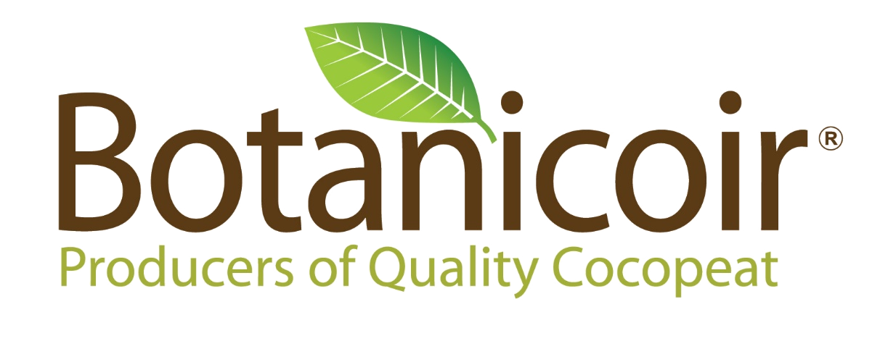
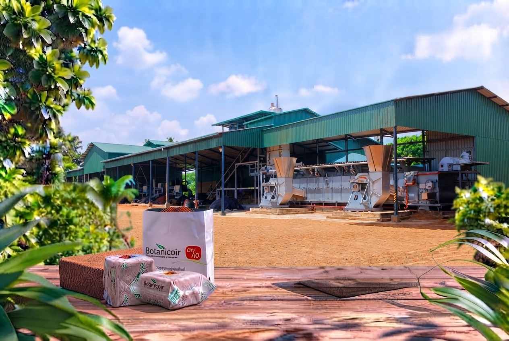

  

<h3 align="center">Engineering at Botanicoir</h3>

  Producers of Quality Cocopeat — this organization hosts the internal engineering 
  team's work building the digital systems that run our production, finance, and logistics operations.

  
  

  

## What we build

Botanicoir manufactures cocopeat products at scale, and this team builds the software that
keeps that operation running — from quality control on the factory floor to the finance and
logistics work behind it. Our repositories are private (internal, operational systems), but
here's what's in active development:

| System | Purpose |
|---|---|
| **QA Application** | Digitizes the SOP-driven quality assurance process — production instructions, job start and ongoing inspections, NCR/CAPA non-conformance handling, and audit-trailed reporting. |
| **Costing System** | Internal costing and pricing management for production. |
| **Petty Cash System** | Petty cash & IOU management with multi-level department/finance approval workflows and cash float tracking. |
| **Freight Management System** | Tracking and coordination for outbound freight and logistics. |
| **GRN Portal** | Goods Received Note processing for the procurement pipeline. |
| **Happy Index** | A no-login, tap-to-rate canteen satisfaction system — workers rate meals, admins plan menus and track satisfaction trends. |

## How we build it

  
  
  
  
  

Most of our systems share the same shape: Laravel + MySQL on the backend, Blade templates with
vanilla JS/CSS on the front end, role-based permissions, and a full audit trail — built for the
people who use them every day on the shop floor, in finance, and in the warehouse.

---

  © Botanicoir — Producers of Quality Cocopeat · <a href="https://www.botanicoir.com/">botanicoir.com</a>

