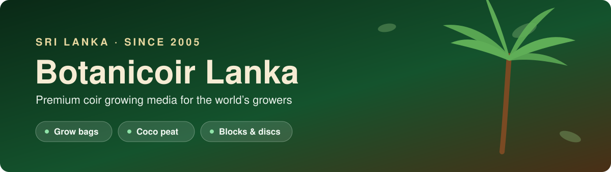
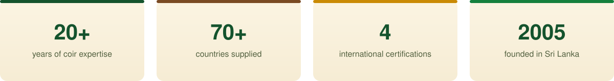
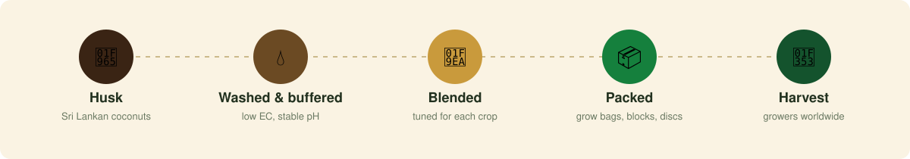

  

  
  
  

## Who we are

**Botanicoir Lanka** turns the humble coconut husk into high-performance growing media. Founded
in 2005 and family-run ever since, we've spent over twenty years supplying commercial growers of
soft fruit, salads and flowers in more than **70 countries**, with coir substrates engineered
around how each crop roots, drinks and breathes.

> Every grow bag starts on a Sri Lankan coconut estate and ends in a harvest somewhere in the world.

  

## From husk to harvest

  

## What we make

| | |
|---|---|
| **Grow bags** | Ready-to-plant coir bags for soft fruits, salads and vegetables, blended for air-filled porosity, water holding and drainage. |
| **Coco peat** | Washed and buffered coir pith with low EC and stable pH, ready for blending into professional growing mixes. |
| **Blocks & briquettes** | Compressed coir that ships efficiently and expands on hydration. |
| **Discs & propagation** | Compact coir discs and propagation media for seedlings and cuttings. |

## Innovation

We invest in research with growers, not just for them. Our **Precision Plus Ultra** mix — developed
for berry and soft-fruit crops — gives rapid hydration, open structure and reliable drainage across
the full season, and our **Beyond Sustainable** initiative helps growers trace and report the
sustainability credentials of the coir they use.

## What lives on this GitHub

This is where our team builds the digital side of Botanicoir: the internal tools that keep
production, quality data, finance and logistics running smoothly. Repositories here are private —
they support live, operational systems — but here's what's in active development:

| System | What it does |
|---|---|
| **QA Application** | Digitizes the SOP-driven quality assurance process — production instructions, job start and ongoing inspections, NCR/CAPA non-conformance handling, and audit-trailed reporting. |
| **Costing System** | Internal costing and pricing management for production. |
| **Petty Cash System** | Petty cash & IOU management with multi-level department/finance approval workflows and cash float tracking. |
| **Freight Management System** | Tracking and coordination for outbound freight and logistics. |
| **GRN Portal** | Goods Received Note processing for the procurement pipeline. |
| **Happy Index** | A no-login, tap-to-rate canteen satisfaction system — workers rate meals, admins plan menus and track trends. |

## Our toolbox

  
  
  
  
  

Most of our systems share the same shape: Laravel + MySQL on the backend, Blade templates with
vanilla JS/CSS on the front end, role-based permissions, and a full audit trail — built for the
people who use them every day on the shop floor, in finance, and in the warehouse.

## Work with us

| | |
|---|---|
| **Growers & distributors** | Looking for a reliable coir partner? [Visit our website](https://www.botanicoir.com/) to talk to our team. |
| **Developers & interns** | Interested in building software for agriculture and manufacturing? We love meeting curious people. |

  

  &copy; Botanicoir Lanka (Pvt) Ltd &middot; Kotte, Sri Lanka

